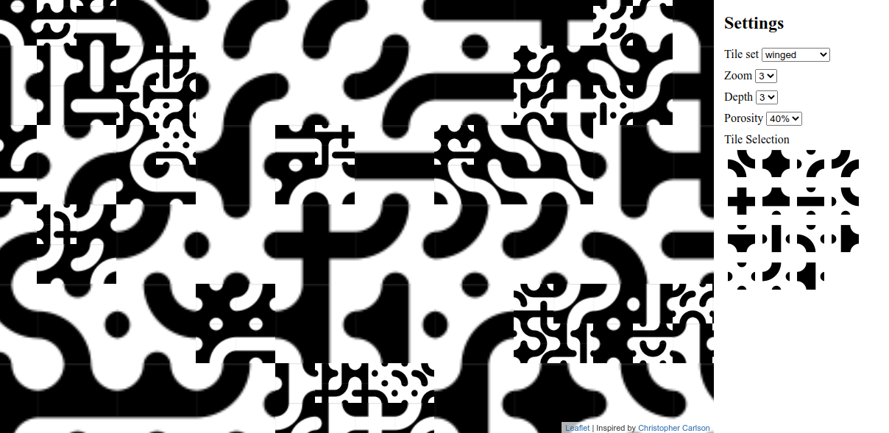

# Truchet Pattern

## About

This page visualizes several patterns using the [truchet tiles](https://en.wikipedia.org/wiki/Truchet_tiles) concept.

The implementation was inspired by [Christopher Carlson's multi-scale truchet patterns](https://christophercarlson.com/portfolio/multi-scale-truchet-patterns/), which was mentioned in the [Operation Mindfuck #4](https://www.youtube.com/watch?v=ywYBT0xM7so) talk of the Chaos Computer Club #rc3 in 2020.

## Installation

Just clone this repository and open the index.html page in your browser

## Dependencies

This implementation heavily relies on [Leaflet](https://leafletjs.com/), an open-source JavaScript library for mobile-friendly interactive maps. The LICENSE of this project follows Leaflet's BSD 2-Clause License.

## Future plans

As Christopher Carlson's work relies on multi-scale, this project will also try to implement it, but the success is not guaranteed. Feel free to contribute :)

Another plan is to opt-out/in certain tiles in the settings to adjust the result.
